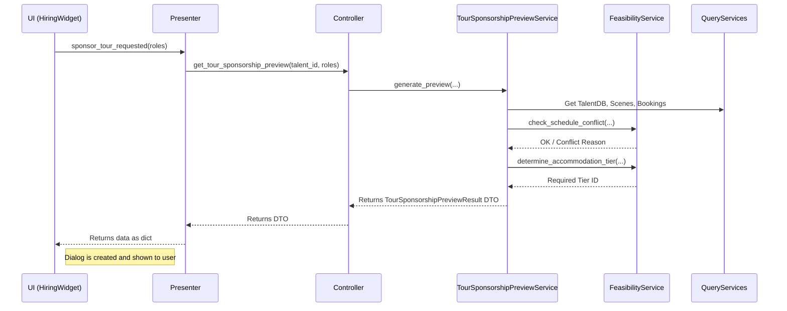
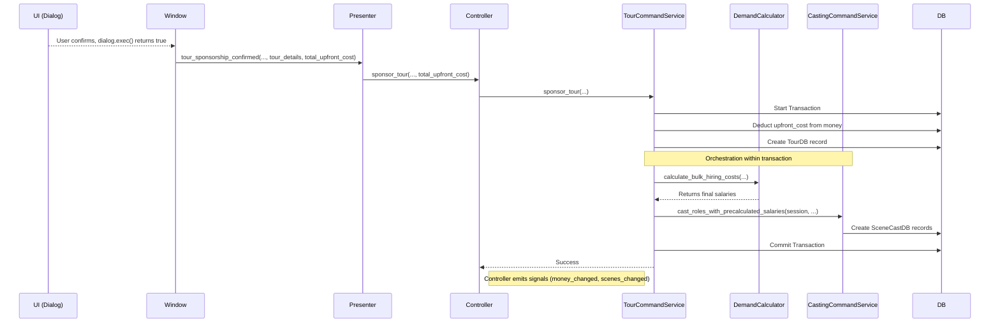

# Tour Feature Implementation Guide

## 1. Executive Summary

The Tour Feature introduces a new core mechanic to the game, allowing talents to travel away from their home base for a set period. This fundamentally impacts their **availability**, **location**, and **hiring cost**.

This system is designed around two primary mechanics:
1.  **Player-Sponsored Tours:** The player can pay upfront costs (travel, accommodation) to bring a non-local talent to their studio location for a multi-week period to shoot a package of scenes.
2.  **Autonomous Tours (Future):** Talents will eventually be able to decide to go on tour by themselves, making them available in new locations but unavailable at their home base.

This document details the architectural patterns, key services, and data flows that make this feature possible, adhering strictly to the established Service Layer Architecture.

---

## 2. User-Facing Features

### 2.1. Sponsoring a Tour

The primary player interaction with this feature is through the **Hiring Widget** in the Talent Profile window.

**Player Workflow:**

1.  The player opens the profile of a talent who is **not** based at the studio's location.
2.  In the Hiring Widget, the player selects two or more available roles.
3.  These roles must fall within a **1 to 4-week period**.
4.  If these conditions are met, the **"Sponsor Tour..."** button becomes enabled.
5.  Clicking the button opens the **Tour Sponsorship Dialog**. This dialog presents the non-negotiable details (duration, destination) and allows the player to choose an accommodation tier for the talent. The total upfront cost is calculated and displayed dynamically.
6.  Upon confirming, the total upfront cost is deducted from the player's money, a `Tour` record is created, and the talent is immediately cast in all the selected roles.

### 2.2. UI Impact

The tour system is visually represented in several places:

*   **Schedule Widget:** A plane icon (`✈`) appears next to the week number for any week a talent is on tour. The tooltip provides details about the tour location.
*   **Hiring Widget:** The cost calculation for roles automatically accounts for a talent's future tour location, potentially reducing travel fees for scenes shot at the tour destination.
*   **Talent Details:** The `current_location` field (not yet displayed in the UI, but available in the data model) is updated to reflect the tour destination while the tour is active.

---

## 3. Architectural Deep Dive

The tour feature's implementation is a prime example of our service architecture. It introduces a new "Location Oracle" and relies heavily on orchestration to maintain transactional integrity.

### 3.1. Core Concept: The "Location Oracle"

The most critical architectural component is the new **`TalentLocationService`**.

*   **Problem:** Many parts of the system (demand calculation, availability checks) need to know where a talent will be on a specific future date. Calculating this involves checking their base location and then iterating through all planned/active tours to see if one covers that date. Putting this logic in every service that needs it would create massive code duplication and tight coupling.
*   **Solution:** The `TalentLocationService` acts as a dedicated, read-only **"Location Oracle"**. Its sole responsibility is to answer the question: "Where will talent X be in week Y of year Z?"
*   **Benefits:**
    *   **Decoupling:** Services like `TalentDemandCalculator` no longer need to know that tours even exist. They simply ask the oracle for the talent's effective location and perform their calculations.
    *   **Efficiency:** The service is optimized with bulk queries to fetch locations for many talents at once, preventing N+1 query problems.
    *   **Single Source of Truth:** All location logic is centralized, making it easy to maintain and debug.

### 3.2. Key Services and Their Roles

This feature introduced several new services and modified existing ones, each with a clearly defined responsibility.

*   **`TalentLocationService` (Query):** The "Location Oracle." Determines a talent's effective location at any point in time.
*   **`TourSponsorshipPreviewService` (Orchestrator/Query):** Orchestrates the data gathering for the UI. When the "Sponsor Tour" button is clicked, this service fetches all necessary data (talent, scenes, bookings) and calls the appropriate feasibility and cost services to generate a `TourSponsorshipPreviewResult` DTO for the dialog.
*   **`TourFeasibilityService` (Calculation):** A pure logic service. Contains business rules for checking tour feasibility (e.g., schedule conflicts, accommodation standards based on talent "pickiness"). It has no side effects.
*   **`UpfrontTourCostCalculator` (Calculation):** A pure logic service. Calculates the upfront costs of a tour (travel + accommodation).
*   **`TourCommandService` (Command):** The primary service for writing tour data to the database. It handles the `sponsor_tour` action, which creates the `TourDB` record and orchestrates the casting of roles within a single transaction. It also handles weekly tour status updates (`planned` -> `active` -> `completed`).
*   **`TalentDemandCalculator` (Calculation - Modified):** Modified to accept an `effective_location` parameter, making it dependent on the Location Oracle rather than calculating travel from a talent's `base_location`.
*   **`CastingCommandService` (Command - Modified):** Refactored to expose a public, orchestrator-callable method (`cast_roles_with_precalculated_salaries`) that allows `TourCommandService` to cast roles as part of its larger atomic transaction.

### 3.3. Data Flow: Sponsoring a Tour

This is the most complex data flow, involving two distinct phases: **Preview** and **Confirmation**.

#### Phase 1: Preview Generation

#### Phase 2: Confirmation and Execution

---

## 4. Data Model Changes

### 4.1. `TourDB` (New Table)

A new table, `tours`, was created to store all information about a tour.

*   `id`: Primary Key
*   `talent_id`: Foreign Key to `talents.id`.
*   `status`: String (`planned`, `active`, `completed`).
*   `destination_location`: The location of the tour.
*   `start_week`, `start_year`: The start date of the tour.
*   `duration_weeks`: Length of the tour.
*   `sponsor_type`: String (`player`, `self`, `ai_studio`).
*   `accommodation_tier_id`: The ID of the accommodation chosen.
*   `upfront_fee_paid`: The amount the player paid upfront.

### 4.2. `TalentDB` (Modified Table)

The `talents` table was updated to track location state.

*   `current_location`: String. The talent's actual location in the current week. Defaults to `base_location` but is overridden by an active tour's `destination_location`.
*   `tours`: A new SQLAlchemy relationship to the `TourDB` model.

---

## 5. Business Rules & Configuration

Key "magic numbers" and business rules are stored in configuration files for easy tuning.

*   **Tour Eligibility:** The UI enforces that a player-sponsored tour must be for 2-4 roles spanning 1-4 weeks. This is defined in `hiring_widget.py` (`_update_sponsor_tour_button_state`).
*   **Accommodation Pickiness:** A talent's required accommodation tier is calculated in `TourFeasibilityService`. The formula is `(total_popularity * pickiness_popularity_scalar) + (ambition * pickiness_ambition_scalar)`. The scalars are defined in `services/models/configs.py` (`HiringConfig`).
*   **Travel & Accommodation Costs:** All costs are defined in `data/game_data/travel_data.json` and `data/game_data/accommodation_tiers.json`.

## 6. Future Work

*   **Autonomous Tours:** The `TourCommandService.process_autonomous_tour_decisions` method is currently a placeholder. The full implementation will involve creating an AI service that calculates a "desire to tour" for each talent based on their archetype, popularity, and recent bookings, allowing them to plan their own tours.
*   **Tour Events:** The tour system provides a framework for new interactive events (e.g., "Talent got homesick on tour," "Talent found a new opportunity while abroad").